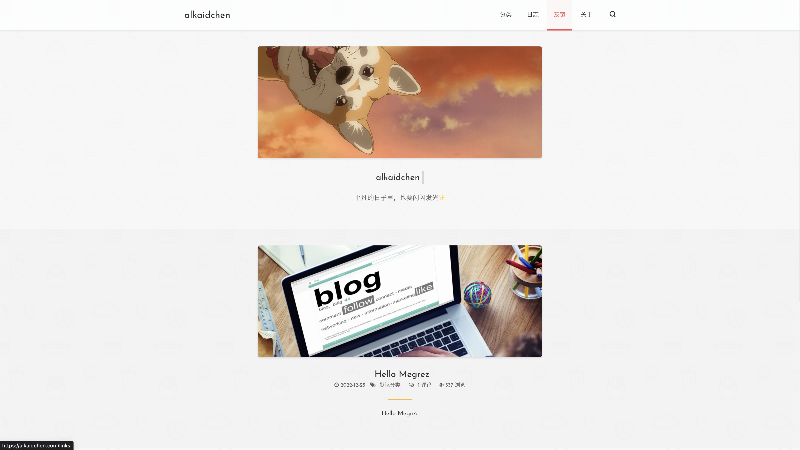
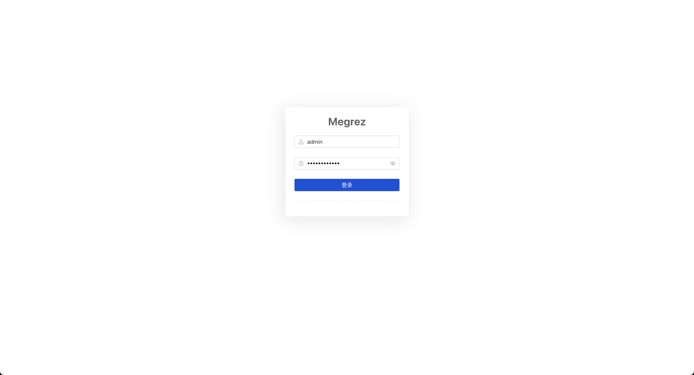
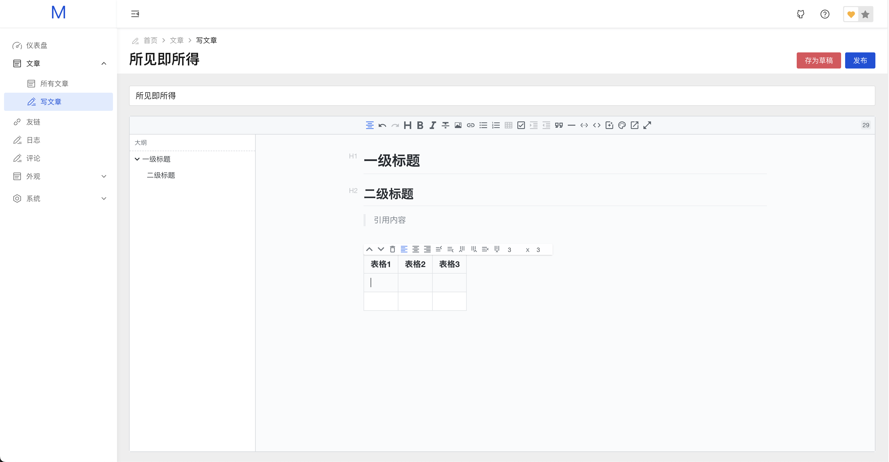
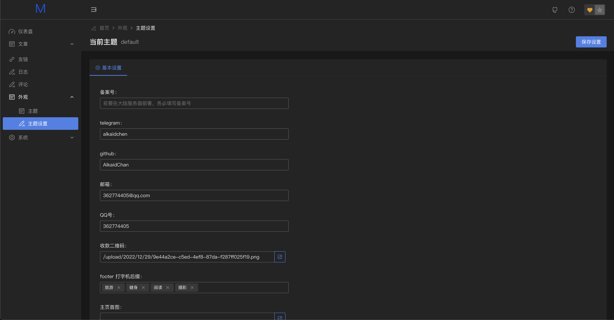

<div align="center">
	<h1>📝 Megrez</h1>
	<span><b>Megrez</b>[ˈmiːɡrɛz] 基于 golang 的博客系统，可跨平台一键部署🚀，支持自定义主题🌈</span>
    <br/>
	<div align="center">
		
        
        
	</div>
</div>

## 🦄 Megrez 名称由来

Megrez 为北斗之一的天权星，古称文曲星，作为博客项目的名字再适合不过了

## 🚀 快速开始

### Windows

click https://github.com/AlkaidChan/megrez/releases/download/0.1.0-alpha.1/megrez-windows-amd64.exe

```bash
$ ./megrez-windows-amd64.exe
```


### MacOS

```bash
$ wget --no-check-certificate https://github.com/AlkaidChan/megrez/releases/download/0.1.0-alpha.1/megrez-darwin-amd64
$ chmod +x megrez-darwin-amd64
$ ./megrez-darwin-amd64
```

### Linux

```bash
$ wget --no-check-certificate https://github.com/AlkaidChan/megrez/releases/download/0.1.0-alpha.1/megrez-linux-amd64
$ chmod +x megrez-linux-amd64
$ ./megrez-linux-amd64
```

### Docker

```bash
$ docker run -it -d --name megrez -p 8080:8080 alkaidchen/megrez
```

## 🔨 编译运行

### 环境要求

- Go >= 1.19
- Node.js（构建管理后台前端所需）
- Make（可选，用于自动化构建）

### 源码编译

```bash
$ git clone --recurse-submodules https://github.com/megrez-dev/megrez.git
$ cd megrez
$ go mod tidy
$ go run main.go
```

### 构建管理后台前端

```bash
$ make admin
```

### 多平台交叉编译

支持 Linux / macOS / Windows（amd64 / arm64），产物输出到 `build/` 目录：

```bash
$ make build-release
```

### Docker 构建

```bash
$ make docker
```

### Makefile 目标一览

| 目标 | 说明 |
|------|------|
| `make tidy` | 整理 Go 模块依赖 |
| `make admin` | 构建前端管理界面 |
| `make docker` | 构建 Docker 镜像 |
| `make docker-release` | 构建并推送 Docker 镜像 |
| `make build-release` | 多平台交叉编译（6 个目标） |

## 🌈 效果预览






